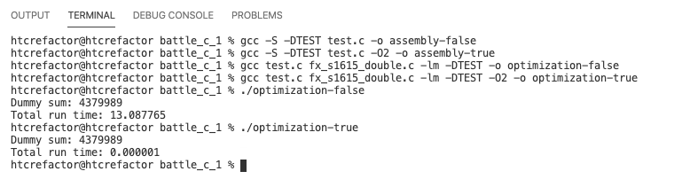
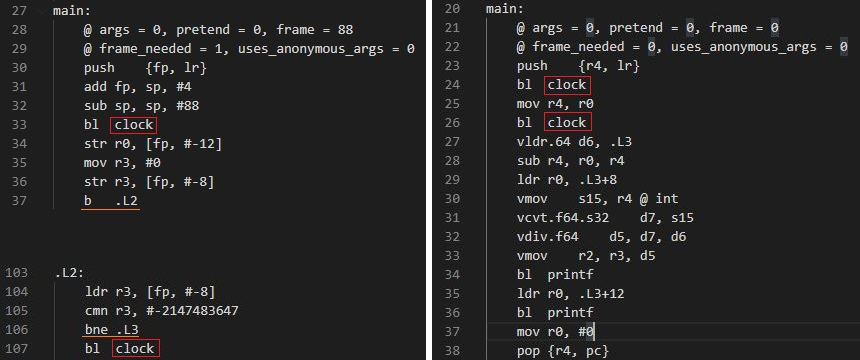

# battle_c_1

첫 번째 프로젝트 : fx_s1615  
Sign bit를 포함한 fixed point number의 arithmetic 구현  
<br>

## Role

| 이름 | 학번 | 역할 |
| ---- | ---- | ---- |
| 고예준 | 201820742 | README 파일 작성 |
| 김지원 | 201720771 | Fixed point arithmetic 구현 |
| 조시호 | 201520659 | README 파일 작성 |
| 최형택 | 201620989 | README 파일 교정 |
<br>

## What is Fixed Point sXXYY?

sXXYY는 2진수로 실수를 표현하는 방법 중 하나다. (1 + XX + YY)개의 비트로 실수를 표현하며 1개 비트는 부호, XX개 비트는 정수부,  YY개 비트는 소수부를 표현한다.  
우리가 구현할 s1615의 경우 32비트를 사용하며 각 비트별로 갖는 의미는 다음과 같다.

| Sign Bit | 정수부 (XX) | 소수부 (YY) |
| ---- | ---- | ---- |
| 0 : 양수, 1 : 음수 | 16 bits | 15 bits |
<br>

```
Maximum : 0111 1111 1111 1111 1111 1111 1111 1111 (2) =  65535.999969482421875 (10)
Minimum : 1111 1111 1111 1111 1111 1111 1111 1111 (2) = -65535.999969482421875 (10)
Resolution : 0000 0000 0000 0000 0000 0000 0000 0001 (2) = 0.000030517578125 (10)
```


### Example

+15000.75라는 수가 있을 때, s1615 고정소수점은 0001 1101 0100 1100 0110 0000 0000 0000<sub>2</sub> 로 표현된다.

```
sign bit: 0 = positive 
정수부:  0011 1010 1001 1000(2) = 15000(10)   
소수부:  0.1100 0000 0000 000(2) = 0.75(10)
```

| Sign Bit | 정수부 (16 bits) | 소수부(15 bits) |
| --- | --- | --- |
| 0 | 0011 1010 1001 1000 | 110 0000 0000 0000 |
| (양수) | 15000 | 1/2 + 1/4 =  0.75 |
<br>

## Fixed Point vs Floating Point
고정 소수점 방식과 다르게, 부동 소수점 방식은 많은 시스템에서 실수를 표현할 때 사용된다 (e.g. `float foo = 3.141592`).  
동일 비트수를 사용할 때 부동 소수점 방식으로 더욱 넓은 범위를 표현할 수 있는 이점이 있기 때문이다.
하지만 부동 소수점만의 표현 방식 때문에 실수를 100% 정확하게 표현할 수 없다는 단점이 있기도 하다.  
이 오차가 누적될 경우 실제로 문제가 되는 경우도 있기 때문에 개발자는 항상 유의해서 코드를 작성해야 한다.  
<br>

## How to Convert Fixed Point Binary to Decimal
s1615를 10진수로 표현하는 방법은 간단하다.   
부호비트를 제외한 31비트 2진수를 10진수로 나타낸 수를 2<sup>YY</sup>로 나눠주면 된다.    

```
0011101010011000110000000000000(2) = 491544576(10)   
491544576 / 2^15 = 15000.75
```  
<br>


## Fixed Point Arithmetic Library


### Project1
#### Macros
* `P2_15 32768.0`

    15자리를 shifting하기 위해 필요한 2<sup>15</sup>를 정의

* `FX_S1615_INT_TO_DOUBLE(a)`

    fx_s1615로 표현한 숫자를 double로 형변환하는 macro

* `FX_S1615_DOUBLE_TO_INT(a)`

    double로 표현한 숫자를 fx_s1615로 형변환하는 macro
<br>
<br>


* `FX_S1615_ADD(a, b)`

    fx_s1615로 표현된 두 값을 더해주는 macro

* `FX_S1615_SUB(a, b)`

    fx_s1615로 표현된 두 값을 빼는 macro

* `FX_S1615_MUL(a, b)`

    fx_s1615로 표현된 두 값을 곱해주는 macro

* `FX_S1615_DIV(a, b)`

    fx_s1615로 표현된 두 값을 나눠주는 macro  
<br>

#### Functions
* `fx_s1615 sine_fx_s1615_int(fx_s1615 a)`

    fx_s1615로 표현된 값의 sin 을 구해주는 함수

* `fx_s1615 sqrt_fx_s1615_int(fx_s1615 a)`

    fx_s1615로 표현된 값의 제곱근을 구해주는 함수

* `fx_s1615 power_fx_s1615_int(fx_s1615 a, double n)`

    fx_s1615로 표현된 값의 n승을 구해주는 함수


### Makefile

1. define : 코드의 재사용성을 증가시키기 위해 반복되는 내용을 정의한다.
```
SRCS := test.c fx_s1615_double.c
OBJS := $(SRCS:.c=.o)
CC := gcc	# pre-defined macro can be redefined!
#CFLAGS = -c -Wall -g
CFLAGS = -c -DTEST -Wall 
```
<br>
<br>


2. 실행 파일 생성  
* $@ : 현재의 target 파일명 
* $^ : 현재 모든 의존 파일들의 명단
* -lm : <math.h> library 추가      


``` 
test : $(OBJS)
	$(CC) -o $@ $^ -lm
```
<br>
<br>


3. 확장자 규칙 적용 : 일일히 목적 파일들을 gcc로 컴파일하지 않아도 된다. 
* $< : 의존 파일 중 첫번째 파일명   
```
# default rule
.c.o : 
	$(CC) $(CFLAGS) $< -lm
```

<br>
<br>


4. make clean :  .o파일과 실행파일을 지워준다.
```
# dummy target - no dependency 
clean : 
	-rm $(OBJS)
	-rm test
```

<br>
<br>


5. make dep : SRCS에 정의된 파일들이 의존하는 파일을 찾아준다. 
```
# dummy target - no dependency 
dep :
	gccmakedep ${SRCS}  # dependency check
```

### gcc -O flag
#### -O 옵션별 세부 사항
`[-Olevel]`
- O0 : 최적화를 수행하지 않음 (Default)
- O, -O1 : 코드 크기와 실행 시간을 줄이는 최적화만 수행
- O2 : 메모리 공간과 속도를 희생하지 않는 범위 내의 모든 최적화를 수행
- O3 : -O2 최적화에 인라인 함수와 레지스터에 대한 최적화를 추가로 수행
- Os : -O2 최적화 기능을 사용하지만, 코드 크기를 증가하는 최적화는 제외

#### 최적화 성능 비교
for문을 통하여 2,147,483,648(INT_MAX)번의 연산을 반복하는 코드를 작성하고 -O0과 -O2 옵션을 주어 컴파일 한 뒤 실행시간을 측정하였다.

##### 결과


최적화를 하지 않았을 때 for문을 수행하는데 약 5분의 시간이 걸렸으나 -O2 옵션으로 최적화하였을 때 for문을 수행했는가 싶을 정도로 실행시간이 줄어들었음을 확인할 수 있었다.

##### 원인 분석
실제로 코드가 어떻게 최적화 되었는지 확인하기 위해 gcc -S 옵션을 통해 컴파일된 어셈블리 코드를 분석해 보았다.
```
pi@raspberrypi:~/battle_c_1 $ gcc -S -DTEST -lm test.c
pi@raspberrypi:~/battle_c_1 $ gcc -S -O2 -DTEST -lm test.c -o test_optimization.s
```

복잡한 어셈블리 코드를 전부 해석하지 않고 for문의 시작 시간과 끝난 시간을 알기 위해 호출했던 clock 함수의 위치를 알 수 있다면 그 사이에 수행되는 어셈블리 코드를 통해 최적화 여부를 알 수 있을 것이다.   
실제로 어셈블리 코드는 아직 link 되어있지 않기 때문에 clock 함수의 시그니처가 그대로 남아있었다.


test.s는 main 라벨에서 처음 clock 함수를 호출한다. 이후 L2 라벨로 이동한뒤 C코드에서 for문에 해당하는 L3 라벨로 이동하고 70줄 가량의 어셈블리 코드를 실행하고 나서야 clock 함수를 호출한다. 라벨을 이동하는 것을 제외하면 C코드와 로직상 다른점이 없다.   
그런데 test_optimization.s는 main 라벨에서 첫 clock 함수를 호출하고 하나의 mov 명령을 수행하자마자 다시 clock 함수를 호출한다. 최적화의 영향인지 for문이 그대로 사라져버렸다.   
실제로 for문 내부에서 실행되는 코드들은 그 안에서만 연산될 뿐 for문 밖의 코드에 영향을 주지 못한다. 외부 변수에 연산의 결과를 저장하거나 출력하는 코드가 없기 때문이다.   
-O2 옵션을 주어 컴파일 하였을 때 컴파일러가 이를 확인하고 어셈블리 코드에 포함시키지 않아 극단적인 성능 차이를 보여준 것으로 보인다.

##### gprof 사용법
```
gcc -pg main.c
./a.out #gmon.out is made after running a.out
gprof
```


### Project2
#### Macros
* `typedef long long fixed64`

    fx_s1615로 표현된 숫자를 long long으로 형변환하는 macro
    
<br>
<br>


* `#define FX_1615_LONGLONG_MUL1(a, b) (fx_s1615) (((fixed64)(a) * (b)) >> 15)`

    fx_s1615로 표현된 값을 long long으로 cast 해준 수를 곱한 후, 15만큼 right shifting 해주는 macro

* `#define FX_1615_LONGLONG_MUL2(a, b) ((a) * (b)) >> 15`

    fx_s1615로 표현된 값을 곱해주고 15만큼 right shifting해주는 macro
    
* `#define FX_1615_LONGLONG_MUL3(a, b) ((a >> 8) * (b >> 7))`

    fx_s1615로 표현된 값인 a를 8만큼 right shifting 해주고, b를 7만큼 right shifiting 해준 후, 두 값을 곱해주는 macro  
    
* `#define FX_1615_LONGLONG_DIV01(a, b) (fx_s1615)((fixed64)((a >> 15) / (b >> 15)) << 15)`

    fx_s1615로 표현된 값을 long long으로 cast 해주고, a와 b를 각각 15만큼 right shfiting 하고 a 와 b를 나눠준 후, 15만큼 left shifting 해주는  macro  
    
* `#define FX_1615_LONGLONG_DIV02(a, b) (fx_s1615)(((fixed64)(a) << 15) / (b))`

    fx_s1615로 표현된 값을 long long으로 cast 해주고, a를 15만큼 left shfiting 하고 b와 나눠주는  macro  
    
* `#define FX_1615_LONGLONG_DIV03(a, b) (((a << 5) / (b >> 6)) << 4)`

    fx_s1615로 표현된 값인 a를 5만큼 left shifting 해주고, b를 6만큼 right shfiting 하고 나눠준 후, 4만큼 left shifting 해주는  macro  
    
<br>

#### Functions
* `fx_s1615 sine_fx_s1615_longlong(fx_s1615 angle)`

    fx_s1615로 표현된 각의 sin 을 구해주는 함수


### 정확도 검증
엑셀 표 넣는거


### 속도 검증
* 32bit 인 경우


* 64bit 인 경우


### Sin

#### sin table
angle 이 0도부터 90도까지인 경우, sin 값을 fx_s1516으로 표현한 SinTable이다.
불필요한 연산을 줄이고자 아래와 같은 SinTable을 사용하게 되었다.

```
const static fx_s1615 fx_1615_SinTable[91] = { 0, 571, 1143, 1714, 2285, 2855,
			3425, 3993, 4560, 5126, 5690, 6252, 6812, 7371, 7927, 8480, 9032,
			9580, 10125, 10668, 11207, 11743, 12275, 12803, 13327, 13848,
			14364, 14876, 15383, 15886, 16384, 16876, 17364, 17846, 18323,
			18794, 19260, 19720, 20173, 20621, 21062, 21497, 21926, 22347,
			22762, 23170, 23571, 23964, 24351, 24730, 25101, 25465, 25821,
			26169, 26509, 26841, 27165, 27481, 27788, 28087, 28377, 28659,
			28932, 29196, 29451, 29697, 29935, 30163, 30381, 30591, 30791,
			30982, 31164, 31336, 31498, 31651, 31794, 31928, 32051, 32165,
			32270, 32364, 32449, 32523, 32588, 32643, 32688, 32723, 32748,
			32763, 32768 
};


```


#### fx_s1615 sine_fx_s1615_longlong(fx_s1615 angle) function에 대하여...
이 함수는 파라미터를 각도로 받아오는 경우, 해당하는 sin값을 찾아서 반환해주는 함수이다.
sin은 360도를 주기로 하는 함수이기 때문에, angle이 360도로 나누었을때의 나머지에 대한 값의 sin 값을 찾아주고자 하였다.

```
idx = angle >> 15;

ret0 = fx_1516_SinTable[idx]; 
diff = fx_1516_SinTable[idx + 1] - ret0;
return ( sign * ( ret0 + ((diff * (angle & 0x7FFF)) >> 15) ));
```

fx_1516_SinTable은 fx_s1516에 맞춰진 표이므로, fx_s1615에 맞춰 변환하기 위해 위의 코드와 작업을 하였다.


<br>
<br>

## 0819 과제

### 요구사항 명세
* 목적
double로 input을 받아서 fx_s1615로 변환하여 사칙연산을 수행한다.


* 제공 기능
함수 설명해주고 얘는 어디에 적합하고 설명해주기

* 실행 방법
make로 실행


### 코딩 규칙 검사(MISRA 2012)
총 39였던 오류를 아래의 20개의 오류로 수정하였다.

```
* #define은 __로 시작할 수 없다.
* int main에 파라미터가 없는 경우 void를 명시적으로 표시해야 한다.
* 함수를 정의하기전에 선언이 필요하다.
* 동일한 이름을 가진 변수가 존재하면 안된다.
```


### 검사 결과 리포트
violations 첨부함